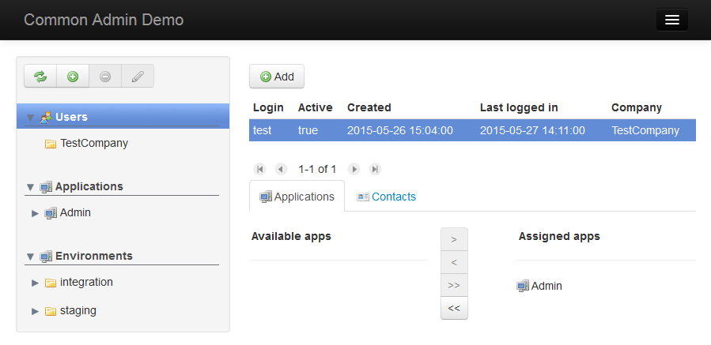
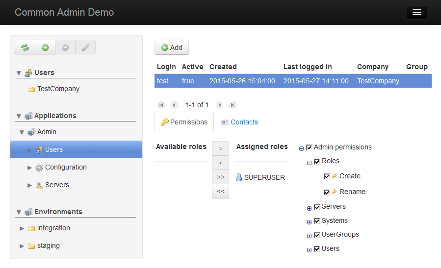
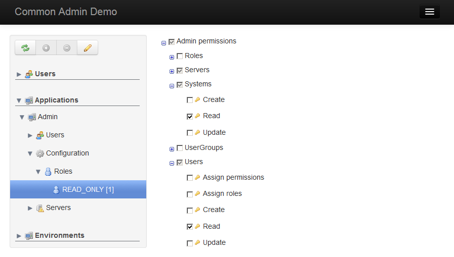

Welcome to the **Scala Commons Admin** documentation page!

## Screenshots

### Assign users to applications

### Assign roles to users

### Assign permissions to roles

## Overview

[Preview](https://www.draw.io/?chrome=0&lightbox=1&url=https%3A%2F%2Fraw.githubusercontent.com%2Fscommons%2Fscommons-admin%2Fmaster%2Fdocs%2Fdrawio%2Foverview.svg%3Ft%3D0) | [Edit](https://www.draw.io/?title=overview.svg&url=https%3A%2F%2Fraw.githubusercontent.com%2Fscommons%2Fscommons-admin%2Fmaster%2Fdocs%2Fdrawio%2Foverview.svg%3Ft%3D0)

## DB Schema

[Preview](https://www.draw.io/?chrome=0&lightbox=1&url=https%3A%2F%2Fraw.githubusercontent.com%2Fscommons%2Fscommons-admin%2Fmaster%2Fdocs%2Fdrawio%2Fdb_schema.svg%3Ft%3D0) | [Edit](https://www.draw.io/?title=db_schema.svg&url=https%3A%2F%2Fraw.githubusercontent.com%2Fscommons%2Fscommons-admin%2Fmaster%2Fdocs%2Fdrawio%2Fdb_schema.svg%3Ft%3D0)

